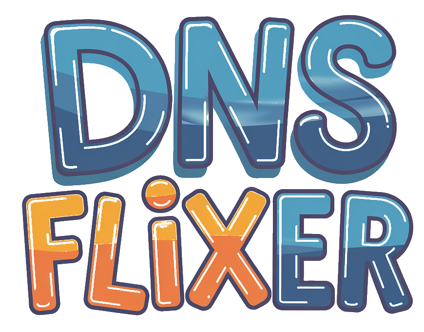

# DNSFlixer
DNSFlixer is a Go app that lets you upload files using HTTP and download them in chunks through DNS queries

## What's in the Box?

- **DNS Server**:
  - Handles TXT record queries to fetch file data.
  - Delivers file content in chunks via DNS queries.
  - Logs all the juicy details of connections and queries.

- **HTTP Server**:
  - Serves static files.
  - Lets you upload files and gives them an MD5-based ID.
  - Logs every step and gives JSON responses.

- **Config Goodies**:
  - Fully customizable using a simple TOML config file.
  - Set your own ports, file paths, and log files.

- **Runs Smoothly**:
  - Uses goroutines to keep DNS and HTTP servers running side-by-side.

## What You Need

- [Go](https://golang.org/) 1.18 or later
- A TOML config file
- These Go packages:
  - `github.com/miekg/dns`
  - `github.com/pelletier/go-toml`

## How to Get Started

1. Clone this repo:

   ```bash
   git clone https://github.com/shamlikt/dnsflixer.git
   cd dnsflixer
   ```

2. Install the dependencies:

   ```bash
   go mod tidy
   ```

3. Build it:

   ```bash
   make build
   ```

## Setting Things Up

Create a `config.toml` file with these settings:

```toml
file_path = "./files"
dns_port = "8053"
http_port = "8080"
log_file = "dnsflixer.log"
```

- **file_path**: Where uploaded files are stored.
- **dns_port**: The port for the DNS server.
- **http_port**: The port for the HTTP server.
- **log_file**: Path to the log file.

## How to Run It

1. Start the app:

   ```bash
   make run
   ```

2. Play with the HTTP server:
   - Upload files via `POST /upload` or `UI`

3. Query the DNS server:

   - Use TXT record queries to fetch file content.
   - Query format: `filehash:index:size`.

### Example Query:

- Upload a file using the HTTP server.
- Use the DNS server to grab chunks of the file:

   ```bash
   dig @127.0.0.1 -p 8053 filehash:index:size TXT
   ```

## Logs

- Logs everything to both the console and the log file.
- Includes connection details, file actions, and any issues.

## Makefile Targets

Here are the available `make` commands:

- **`make build`**: Builds the application and outputs the binary to the `build/` directory.
- **`make run`**: Builds and runs the application with the default config.
- **`make fmt`**: Formats the Go codebase using `gofmt`.
- **`make clean`**: Cleans up the build artifacts.
- **`make install`**: Installs dependencies using `go mod tidy`.

## Wanna Tweak It?

Feel free to:

1. Modify the `dns` or `httpserver` code as needed.
2. Rebuild it:

   ```bash
   make build
   ```

## Dependencies

- [github.com/miekg/dns](https://github.com/miekg/dns)
- [github.com/pelletier/go-toml](https://github.com/pelletier/go-toml)

## License

MIT License. Do whatever you want with it (just give credit where it’s due).

## Made By

Shamlik Thondikkodan

---

Found a bug? Got an idea? Open an issue or shoot a message on the [GitHub repo](https://github.com/shamlikt/dnsflixer).

